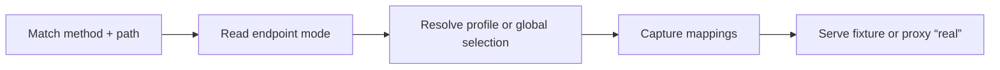

# Creating a Mock Endpoint

How to add a new mocked endpoint to the catalog, what each field does, and every
framework feature you get along the way — ID extraction, scenarios, fixtures,
placeholders, and passthrough.

## Running the server

The fastest way to try it locally, against a `catalog/` directory in the current
folder:

```bash
npx mock-server ./catalog
```

No external MongoDB is required to get started — if `MONGODB_CONNECTION_STRING`
isn't set, an in-memory MongoDB starts automatically (data is ephemeral). The
project also publishes a Docker image; see the
[README](https://github.com/bilal-fazlani/mock-server#readme) for `docker run`
instructions and the full environment variable list, or
[Configuration](guide/reference/configuration.md) for `CATALOG_PATH`,
`MONGODB_CONNECTION_STRING`, and every other setting.

## Mental model

The mock server is **data-driven**. You never write request-handling code to add
an endpoint — you create directories and JSON files under a `catalog/` tree. The
routing engine walks that tree and reads them at startup.

Six concepts:

| Concept | What it is |
| --- | --- |
| **System** | A group of endpoints belonging to one upstream service (e.g. "Hello System"), represented as a directory under `catalog/`. Carries the env var that holds the real upstream base URL. |
| **Endpoint** | One mockable route: a method + path template, plus whether scenario selection is per-profile or global. Represented as a sub-directory of its system. |
| **Profile** | A record keyed by a *business ID* (e.g. `customer-123`) that stores, per profiled endpoint, which scenario that caller should receive — but *only where it differs from* the configured implicit scenario. A pick can also be an ordered [scenario sequence](guide/reference/scenarios.md#scenario-sequences) served call-by-call. Stored in MongoDB, edited in the UI at `/ui`. |
| **Global mock selection** | A shared scenario pick for a profile-less endpoint. Stored once in MongoDB, applies to every caller, and is edited on `/ui/global-mocks`. |
| **Profile key mapping** | A MongoDB lookup from another request key to a profile ID, such as `event-id / evt-123 → customer-123`. Useful when a later callback has an event ID but no profile ID. |
| **Scenario** | A named outcome for an endpoint, one `<scenario>.json` fixture file per scenario. Every endpoint must have a `default.json`; the special `real` scenario (proxy to the live upstream) is *implicit on every endpoint* and must never have a fixture file. |
| **Fixture** | The canned JSON response (status + headers + body) backing one scenario file, with optional request-driven placeholders. |

At request time the engine does this:



The full ordered walk is documented in [Request lifecycle](request-lifecycle.md).

!!! note "Where endpoints are served"

    Mock endpoints are served at the **root** of the app origin. The catalog
    `path` *is* the URL path — an endpoint with `"path": "/hello/world"` answers
    at `<origin>/hello/world`. (The app's own UI lives under `/ui/*`, kept out of
    the way.)

## The catalog tree

Everything lives under a single `ui/catalog/` tree — one directory per system,
one sub-directory per endpoint, one file per scenario. There is no central
manifest to edit.

```text
catalog/
  hello-system/                 # system directory; its name IS the system slug
    _system.json                # { "name", "baseUrlEnv" }
    hello_world/                # endpoint directory; its name IS the endpoint name
      _endpoint.json            # { "displayName", "method", "path", optional "mockType", "profileIdSelector", "captureProfileKeys" }
      _schema.json              # optional — request/response JSON Schema, see Schemas
      default.json              # required — every endpoint needs a default scenario
      failure.json              # any other <scenario>.json is a scenario
```

The **system slug** is not derived from anything — it *is* the directory name
(`hello-system` above). Likewise the **endpoint name** is the directory name
(`hello_world`). Both must be filesystem-friendly on their own terms: the loader
accepts any directory name for a system or endpoint; only scenario filenames are
structurally constrained to `[a-z0-9][a-z0-9_-]*` — though following the same
pattern for directories is good practice. `_system.json` and `_endpoint.json`
are metadata — required in every system and endpoint directory respectively.
Dotfiles are ignored; anything else that doesn't fit this shape (a stray file, a
badly-named scenario file, a missing metadata file) is a **structural error**,
reported at startup.

## Where to go next

- **[Getting started](guide/getting-started.md)** — add an endpoint in five steps.
- **[Reference](guide/reference/endpoints.md)** — every field and feature in detail.
- **[Request lifecycle](request-lifecycle.md)** — what the engine does for every request.
- **[Gotchas](guide/gotchas.md)** — rules of thumb and a worked GET example.
