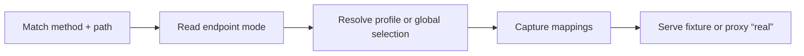

# Mock Server

A **data-driven** mock server: you mock an upstream service by creating
directories and JSON files under a `catalog/` tree — no request-handling code —
and the routing engine serves them. Point your app at it in local dev or CI,
switch scenarios per caller, and proxy to the real upstream when you want to.
When a scenario has to be *decided* per call, a scenario can also be backed by a
small JavaScript [resolver](building/dynamic.md) that picks one of your fixtures.

This guide covers the mental model below, then splits into **[Building
mocks](building/endpoints.md)** (authoring the catalog) and **[Driving
mocks](driving/api.md)** (controlling a running server from the UI or API).

## Running the server

The fastest start, against a `catalog/` directory in the current folder:

```bash
npx @bilal-fazlani/mock-server ./catalog
```

No external MongoDB is required — if `MONGODB_CONNECTION_STRING` isn't set, an
in-memory MongoDB starts automatically (data is ephemeral). See **[Install &
run](get-started/install.md)** for Docker, from-source, and CI setups, and
**[Configuration](reference/configuration.md)** for `CATALOG_PATH`,
`MONGODB_CONNECTION_STRING`, and every other setting.

## Mental model

The mock server is **data-driven**. You never write request-handling code to add
an endpoint — you create directories and JSON files under a `catalog/` tree. The
routing engine walks that tree and reads them at startup. Code enters only as an
opt-in *choice* of response: a [resolver](building/dynamic.md) picks which
fixture answers a call, and never builds the response itself.

Eight concepts:

| Concept | What it is |
| --- | --- |
| **System** | A group of endpoints belonging to one upstream service (e.g. "Hello System"), represented as a directory under `catalog/`. Carries the env var that holds the real upstream base URL. |
| **Endpoint** | One mockable route: a method + path template, plus whether scenario selection is per-profile or global. Represented as a sub-directory of its system. |
| **Profile** | A record keyed by a *business ID* (e.g. `customer-123`) that stores, per profiled endpoint, which scenario that caller should receive — but *only where it differs from* the configured implicit scenario. A pick can also be an ordered [scenario sequence](building/scenarios.md#scenario-sequences) served call-by-call. Stored in MongoDB, edited in the UI at `/ui`. |
| **Global mock selection** | A shared scenario pick for a profile-less endpoint. Stored once in MongoDB, applies to every caller, and is edited on `/ui/global-mocks`. |
| **Profile key mapping** | A MongoDB lookup from another request key to a profile ID, such as `event-id / evt-123 → customer-123`. Useful when a later callback has an event ID but no profile ID. |
| **Scenario** | A named outcome for an endpoint, backed by one file per scenario: either a `<scenario>.json` fixture or a `<scenario>.mjs` resolver. Every endpoint must have a `default` (either backing); the special `real` scenario (proxy to the live upstream) is *implicit on every endpoint* and must never have a file. See [Scenarios](building/scenarios.md) and [Code-backed scenario resolvers](building/dynamic.md). |
| **Fixture** | The canned JSON response (status + headers + body) backing a fixture-backed scenario, with optional request-driven placeholders. |
| **Resolver** | A pure, synchronous JavaScript function backing a code-backed scenario (`<scenario>.mjs`); it inspects the request and a bounded history and returns which fixture-backed scenario (or `"real"`) should answer this call. See [Code-backed scenario resolvers](building/dynamic.md). |

At request time the engine does this:



The full ordered walk is documented in [Request lifecycle](reference/request-lifecycle.md).

!!! note "Where endpoints are served"

    Mock endpoints are served at the **root** of the app origin. The catalog
    `path` *is* the URL path — an endpoint with `"path": "/hello/world"` answers
    at `<origin>/hello/world`. (The app's own UI lives under `/ui/*`, kept out of
    the way.)

## The catalog tree

Everything lives under a single `catalog/` tree — one directory per system,
one sub-directory per endpoint, one file per scenario. There is no central
manifest to edit.

```text
catalog/
  hello-system/                 # system directory; its name IS the system slug
    _system.json                # { "name", "baseUrlEnv" }
    _spec.yaml                  # optional — one OpenAPI doc supplying schemas for the whole system, see Schemas (.yml/.json also accepted)
    hello_world/                # endpoint directory; its name IS the endpoint name
      _endpoint.json            # { "displayName", "method", "path", optional "mockType", "profileIdSelector", "captureProfileKeys" }
      _schema.json              # optional — per-endpoint request/response JSON Schema (mutually exclusive with a system _spec), see Schemas
      default.json              # required — every endpoint needs a default scenario, as default.json or default.mjs
      failure.json              # any other <scenario>.json is a fixture-backed scenario
      by-amount.mjs              # any other <scenario>.mjs is a resolver-backed scenario, see Code-backed scenario resolvers
```

The **system slug** is not derived from anything — it *is* the directory name
(`hello-system` above). Likewise the **endpoint name** is the directory name
(`hello_world`). Both must be filesystem-friendly on their own terms: the loader
accepts any directory name for a system or endpoint; only scenario filenames are
structurally constrained to `[a-z0-9][a-z0-9_-]*` — though following the same
pattern for directories is good practice. `_system.json` and `_endpoint.json`
are metadata — required in every system and endpoint directory respectively.
Dotfiles are ignored; anything else that doesn't fit this shape (a stray file, a
badly-named scenario file, a missing metadata file) is a **structural error**,
reported at startup.

## Where to go next

- **[Install & run](get-started/install.md)** — npx, Docker, and from-source setup.
- **[Your first mock endpoint](get-started/first-mock.md)** — add an endpoint in five steps.
- **[Building mocks](building/endpoints.md)** — every catalog field and feature in detail.
- **[Driving mocks](driving/api.md)** — control a running server from the UI or the API, and use it in dev & CI.
- **[Request lifecycle](reference/request-lifecycle.md)** — what the engine does for every request.
- **[Gotchas](reference/gotchas.md)** — rules of thumb and a worked GET example.
