# Request routing flow

How an incoming request is resolved to a response, as implemented in
`src/lib/router/route-request.ts`.

## The ordered walk

What the engine does for every incoming request, in order:

| # | Step | On failure |
| --- | --- | --- |
| 1 | Match `method` + `path` against the catalog. | `404 no matching endpoint` |
| 2 | If a body is present, parse it as JSON. | `400` always |
| 3a | For a profiled endpoint, resolve the profile ID. Reusable direct selectors use body/path/query values; Bearer selectors use the opaque credential or a top-level JWT claim; `profileKey` selectors first extract the nested body/path/query key, then look up `profileKeyMappings`. | Selector missing or malformed → `400`; mapping missing → `404 profile_key_mapping_not_found` |
| 3b | For a global endpoint, skip profile ID resolution and read the saved shared selection from `globalMockScenarios`. | — |
| 4 | For a profiled endpoint, load that profile from MongoDB. | Not found → `UNMOCKED_USERS` policy: `ERROR` → `404`; `DEFAULT_MOCK` → serve `default`; `REAL` → proxy |
| 5 | Resolve the scenario: saved profile/global pick, else the implicit scenario from `PASSTHROUGH_AS_DEFAULT`. If the pick is a [sequence](guide/reference/scenarios.md#scenario-sequences), atomically advance its progress counter and take the step it lands on (sticking on the last step once exhausted). | Pinned key no longer declared → `500` |
| 6 | If the resolved scenario is `dynamic`, look up the endpoint's compiled `_dynamic.ts`, read its history window, and invoke it with the request + history + profile ID. Rewrite the scenario to its return value and append that value to history. | No compiled resolver → `500 dynamic_resolver_missing`; throws → `500 dynamic_threw`; exceeds its timeout → `500 dynamic_timeout`; returns anything other than a declared scenario or `"real"` → `500 dynamic_bad_return` (nothing appended to history) |
| 7 | For direct-profile endpoints with `captureProfileKeys`, store each mapping before fixture serving or real proxying. | Capture key missing → `400`; same key for a different profile → `409 profile_key_mapping_conflict` |
| 8a | If scenario is `real`: proxy to the `baseUrlEnv` upstream and return its response. | Missing base URL → `500` (startup prevents this only when `PASSTHROUGH_AS_DEFAULT=true`) |
| 8b | Otherwise: take the cached fixture, resolve placeholders, return its status/headers/body. | Placeholder didn't resolve → `500` |

Step 6 only runs when scenario resolution (step 5) lands on `dynamic` — for
every other resolved scenario, routing falls straight from step 5 to step 7.
Once step 6 rewrites the scenario, the rest of the walk (steps 7, 8a/8b)
proceeds exactly as if that rewritten slug (including `real`) had been the
original pick — see [Dynamic scenarios](guide/reference/dynamic.md).

Three things wrap every logged request, whichever row it exits at: the server may
print a one-line console summary depending on `MOCK_CONSOLE_LOG_LEVEL`; the
response carries an `x-mock-log-id` header naming the
[request log](guide/reference/request-logs.md) entry it produced; and after the
response is sent that entry — request, response, and the decision trace from the
steps above — is written fire-and-forget, so logging can never slow down or fail a
mock response. Requests whose path begins with `/_next/` skip this wrapper
entirely.

## App-level configuration

App-wide behavior is governed by a handful of environment variables —
`PASSTHROUGH_AS_DEFAULT`, `UNMOCKED_USERS`, `PASSTHROUGH_TIMEOUT_MS`,
`MOCK_CONSOLE_LOG_LEVEL`, and `DYNAMIC_HISTORY_LIMIT`. Each one's values and
defaults are documented as settings in
[Configuration](guide/reference/configuration.md#app-configuration); this page
describes how they steer the flow.

`PASSTHROUGH_AS_DEFAULT` controls the implicit scenario for missing profile/global
selections. When `false` (default), missing selections resolve to `default` and
`real` appears last in UI pickers. When `true`, missing selections resolve to
`real`, `real` appears first, and startup requires every system's `baseUrlEnv` to
be set. `UNMOCKED_USERS` is the policy when profile ID resolution succeeds but no
profile exists. `PASSTHROUGH_TIMEOUT_MS` bounds `real` upstream requests; a
timeout returns `504`.

Passthrough is always a legal implicit scenario named `real`. If a request
resolves to `real` and the system's base URL is missing, the mock API returns a
loud `500` naming the missing env var. Startup catches that earlier only when
`PASSTHROUGH_AS_DEFAULT=true`, because passthrough is then the implicit behavior.

Malformed requests (invalid JSON body, selector that does not resolve) are always
loud `400`s. A `profileKey` selector whose key is present but has no stored mapping
is a loud `404` before profile lookup. `UNMOCKED_USERS` applies only after a
profile ID has been resolved and the profile itself is missing.

If a mocked endpoint has an `_schema.json`, a request body that does not match its
request schema is also a loud `400`. Request-schema validation is skipped when the
resolved scenario is `real`. See [Schemas](guide/reference/schemas.md).

## Endpoint modes

Endpoints are either profiled or global:

- **Profiled**: the default mode for existing catalog entries. The endpoint has a
  `profileIdSelector`, loads a mock profile, and reads
  `profile.endpointScenarios[endpoint.name]`.
- **Global**: declared with `mockType: "global"`. The endpoint has no
  `profileIdSelector`, does not use profile-key mappings, and reads one shared
  scenario selection from the Global mocks page.

An endpoint must not be both. Startup validation rejects global endpoints that
declare `profileIdSelector` or `captureProfileKeys`, and rejects profiled
endpoints without `profileIdSelector`.

## Reserved scenario names

- **`default`** — every endpoint must have `default.json`.
- **`real`** — must never have a fixture file. It means passthrough to the
  system's configured upstream base URL.
- **`dynamic`** — must never have a fixture file either. Offered only on
  endpoints with a `_dynamic.ts` resolver; selecting it runs that resolver at
  request time and rewrites the scenario to whatever slug (or `real`) it
  returns, per step 6 above. See [Dynamic scenarios](guide/reference/dynamic.md).

Profile and global selections are stored as deltas against the configured implicit
scenario:

- `PASSTHROUGH_AS_DEFAULT=false`: selecting `default` stores nothing.
- `PASSTHROUGH_AS_DEFAULT=true`: selecting `real` stores nothing.

A profiled endpoint can instead store an ordered scenario sequence. Each request
that reaches scenario resolution atomically advances the sequence by one step;
after the final step, the endpoint keeps selecting that final scenario. An empty
sequence behaves like no selection and uses the implicit scenario. Changing the
saved sequence restarts its progress on the next request. See
[Scenario sequences](guide/reference/scenarios.md#scenario-sequences).

## Startup validation

Startup fails hard if any of:

- existing catalog/fixture checks fail: path templates, selectors, fixture shape,
  placeholders, ambiguous endpoints, schemas;
- an endpoint lacks `default.json` or declares `real.json` or `dynamic.json`;
- a global endpoint declares profile-only fields;
- a profiled endpoint lacks `profileIdSelector`;
- `PASSTHROUGH_AS_DEFAULT=true` and any system's `baseUrlEnv` is unset;
- any endpoint's `_dynamic.ts` fails to compile or doesn't default-export a
  function.

The full list of checks is in
[Validation rules](guide/reference/configuration.md#validation-rules).

## Flow

```mermaid
flowchart TD
    Start([Request arrives]) --> Match{"Method + path match<br/>a catalog endpoint?"}
    Match -- No --> R404["404 - no matching endpoint"]
    Match -- Yes --> Body{"Request body present?"}

    Body -- Yes --> ParseJSON{"Body is valid JSON?"}
    ParseJSON -- No --> RBadJson["400 - invalid JSON body"]
    ParseJSON -- Yes --> Mode{"endpoint mockType?"}
    Body -- No --> Mode

    Mode -- global --> GlobalSel["scenario = saved global selection<br/>?? implicit scenario"]
    Mode -- profiled --> Selector{"Profile-ID selector<br/>resolves a value?"}

    Selector -- No --> RSel["400 - selector did not resolve"]
    Selector -- Yes --> Mapped{"profileKey selector?"}
    Mapped -- Yes --> Mapping{"Mapping exists<br/>for namespace + key?"}
    Mapping -- No --> RMapping["404 - profile key mapping not found"]
    Mapping -- Yes --> Lookup{"Profile found in store?"}
    Mapped -- No --> Lookup

    Lookup -- No --> Unmocked{"UNMOCKED_USERS?"}
    Unmocked -- ERROR --> RUnmocked["404 - profile not found"]
    Unmocked -- DEFAULT_MOCK --> UseDefault["scenario = default"]
    Unmocked -- REAL --> UseReal["scenario = real"]

    Lookup -- Yes --> Pick{"Saved profile selection?"}
    Pick -- None or empty sequence --> ProfileImplicit["scenario = implicit scenario"]
    Pick -- Single scenario --> ProfilePin["scenario = saved pin"]
    Pick -- Sequence --> Advance["Atomically advance progress<br/>scenario = current step<br/>(stick on final step)"]

    ProfileImplicit --> IsDynamic{"scenario == dynamic?"}
    ProfilePin --> IsDynamic
    Advance --> IsDynamic
    GlobalSel --> IsDynamic
    UseDefault --> IsDynamic
    UseReal --> IsDynamic

    IsDynamic -- No --> IsReal{"scenario == real?"}
    IsDynamic -- Yes --> HasResolver{"_dynamic.ts compiled<br/>for this endpoint?"}
    HasResolver -- No --> RNoResolver["500 - dynamic_resolver_missing"]
    HasResolver -- Yes --> RunResolver["Invoke resolver with<br/>request + history + profileId"]
    RunResolver -- Throws --> RThrew["500 - dynamic_threw"]
    RunResolver -- Timeout --> RDynTimeout["500 - dynamic_timeout"]
    RunResolver -- "Invalid return<br/>(undeclared slug, non-string,<br/>or literal 'dynamic')" --> RBadReturn["500 - dynamic_bad_return"]
    RunResolver -- "Valid return<br/>(declared scenario or 'real')" --> AppendHistory["Append returned slug to history<br/>scenario = returned slug"]
    AppendHistory --> IsReal

    IsReal -- Yes --> CaptureReal{"Profiled key capture<br/>configured?"}
    CaptureReal -- Conflict --> RConflict["409 - profile key mapping conflict"]
    CaptureReal -- MissingKey --> RCapSel["400 - capture key selector did not resolve"]
    CaptureReal -- No, global, or success --> ProxyURL{"baseUrlEnv set?"}
    ProxyURL -- No --> RNoBase["500 - missing upstream base URL"]
    ProxyURL -- Yes --> Proxy["Proxy request to real upstream"]
    Proxy -- Transport failure --> RProxyFail["502 - passthrough request failed"]
    Proxy -- Timeout --> RTimeout["Create 504 JSON timeout response"]
    Proxy -- Upstream response --> DriftProbe["For parseable JSON + response schema:<br/>record drift warning if invalid"]
    RTimeout --> DriftProbe
    DriftProbe --> RProxy["Return response unchanged"]

    IsReal -- No --> RequestSchema{"Request matches schema?<br/>(if one exists)"}
    RequestSchema -- No --> RRequestSchema["400 - request body does not match schema"]
    RequestSchema -- Yes or no schema --> CaptureMock{"Profiled key capture<br/>configured?"}
    CaptureMock -- Conflict --> RConflict
    CaptureMock -- MissingKey --> RCapSel
    CaptureMock -- No, global, or success --> Declared{"scenario declared<br/>in endpoint.scenarios?"}
    Declared -- No --> RDrift["500 - saved scenario no longer declared"]
    Declared -- Yes --> LoadFix["Load scenario fixture"]
    LoadFix -- Fixture error --> RFixErr["500 - fixture or placeholder error"]
    LoadFix -- Loaded --> TemplateBody{"Body placeholders resolve<br/>against this request?"}
    TemplateBody -- No --> RFixErr
    TemplateBody -- Yes --> ResponseSchema{"Generated body matches response schema?<br/>(if one exists)"}
    ResponseSchema -- No --> RResponseSchema["500 - generated response does not match schema"]
    ResponseSchema -- Yes or no schema --> TemplateHeaders{"Header placeholders resolve?"}
    TemplateHeaders -- No --> RFixErr
    TemplateHeaders -- Yes --> RFix["Return fixture status, headers, and body"]
```

## Reading the branches

- **Global endpoints** skip profile ID extraction, profile lookup, and profile key
  capture. They still share fixture rendering, schema checks, templating, and
  passthrough behavior.
- **Profiled endpoint gaps** and **global selection gaps** both use the same
  implicit scenario from `PASSTHROUGH_AS_DEFAULT`.
- **Profile scenario sequences** advance before the router branches between a
  fixture and `real`, so any sequence step can select passthrough.
- **The `dynamic` resolver** runs after scenario resolution (including sequence
  advancement) but before the `real`/fixture branch, and only when the
  resolved slug is literally `dynamic`. It rewrites the scenario in place, so
  everything downstream — passthrough, fixture load, templating, schema
  checks, tracing — treats the resolver's return value exactly like a directly
  picked scenario. See [Dynamic scenarios](guide/reference/dynamic.md).
- **Unmocked users** are still controlled by `UNMOCKED_USERS`; that policy is
  separate from the defaulting policy for existing profiles/global selections.
- **Profile key capture** runs before the base-URL check on `real`, and after
  mocked request-schema validation but before the stale-scenario check on a
  fixture path. A capture failure therefore stops the request at that point.
- **Mock schemas** are enforced: request failures return 400 and generated
  response failures return 500. **Real responses** are only checked for drift when
  they contain parseable JSON; violations are recorded as warnings and the
  upstream response is returned unchanged.
- **Passthrough failures** return 502 when the upstream request throws, or 504
  when it exceeds `PASSTHROUGH_TIMEOUT_MS` (30 seconds by default).
- **Saved `real` selections** are never stale because of config, but the UI can
  warn when the selected endpoint's base URL is missing.
- **Saved fixture selections**, including individual sequence steps, become stale
  if the catalog removes that scenario. The UI flags them; the router returns a
  loud 500 if stale state is still used.
