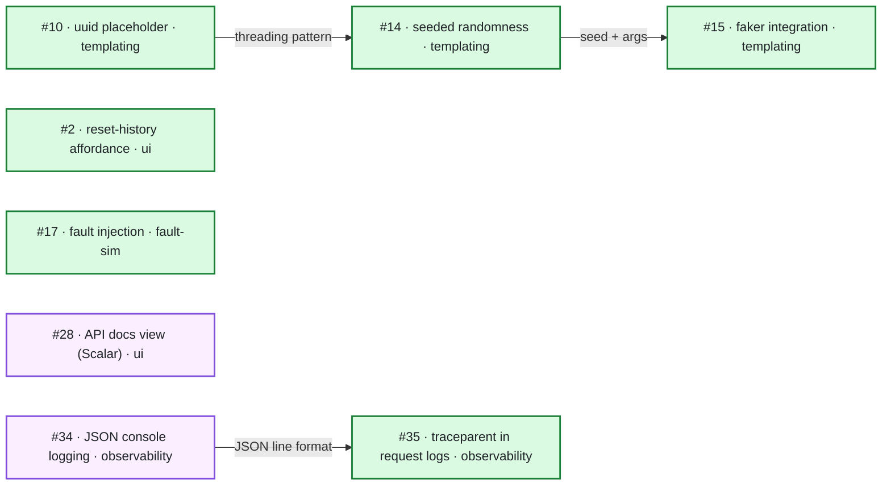
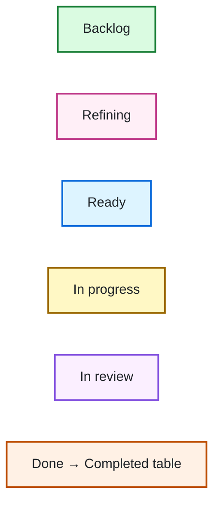

# Tickets

## Open tickets

**Legend** — node colour is the lane on [project board 3](https://github.com/users/bilal-fazlani/projects/3), matching its colours there:

| # | Title | Type | Area |
|---|---|---|---|
| [#35](https://github.com/bilal-fazlani/mock-server/issues/35) | propagate inbound `traceparent` into request logs and the logs view | enhancement | observability |
| [#34](https://github.com/bilal-fazlani/mock-server/issues/34) | structured JSON console logging via `MOCK_LOG_FORMAT` | enhancement | observability |
| [#28](https://github.com/bilal-fazlani/mock-server/issues/28) | spike: per-system API docs view rendering `_spec.yaml` with Scalar | enhancement | ui |
| [#17](https://github.com/bilal-fazlani/mock-server/issues/17) | Fault injection — connection reset, hung socket, malformed JSON body | enhancement | fault-sim |
| [#15](https://github.com/bilal-fazlani/mock-server/issues/15) | Placeholder: Faker integration — `{{faker:person.fullName}}`, `{{faker:internet.email}}` | enhancement | templating |
| [#14](https://github.com/bilal-fazlani/mock-server/issues/14) | Placeholder: seeded randomness — `{{random:int:1:100}}` stable per (profileId, endpoint) | enhancement | templating |
| [#10](https://github.com/bilal-fazlani/mock-server/issues/10) | Placeholder: `{{uuid}}` — random UUID via `crypto.randomUUID()`, injected like `now` | enhancement | templating |
| [#2](https://github.com/bilal-fazlani/mock-server/issues/2) | Inconsistent "Reset dynamic history" affordance: global mocks vs profiles | bug | ui |

## Completed

| # | Title | Type | Area | Closed |
|---|---|---|---|---|
| [#32](https://github.com/bilal-fazlani/mock-server/issues/32) | new-profile page is statically prerendered and ignores runtime `PASSTHROUGH_AS_DEFAULT` | bug | ui | 2026-07-23 |
| [#30](https://github.com/bilal-fazlani/mock-server/issues/30) | replace `now` format enum with named formats plus free-form date/time token patterns | enhancement | templating | 2026-07-22 |
| [#27](https://github.com/bilal-fazlani/mock-server/issues/27) | catalog lint: flag placeholders referencing schema-optional body fields without a fallback | enhancement | templating | 2026-07-22 |
| [#24](https://github.com/bilal-fazlani/mock-server/issues/24) | Placeholder: opt-in omission — drop a response field when its selector is absent | enhancement | templating | 2026-07-21 |
| [#29](https://github.com/bilal-fazlani/mock-server/issues/29) | global endpoints appear in the profile create/edit form | bug | ui | 2026-07-21 |
| [#13](https://github.com/bilal-fazlani/mock-server/issues/13) | Placeholder: string transforms — lower, trim (closed built-in set) | enhancement | templating | 2026-07-21 |
| [#11](https://github.com/bilal-fazlani/mock-server/issues/11) | Placeholder: `default` fallback filter — `{{$.name\|Guest}}` | enhancement | templating | 2026-07-20 |
| [#6](https://github.com/bilal-fazlani/mock-server/issues/6) | Resolver history for unmocked callers is never cleaned up — add TTL or cleanup job | tech-debt | resolver | 2026-07-19 |
| [#9](https://github.com/bilal-fazlani/mock-server/issues/9) | Placeholder: `header:` selector — echo a request header (e.g. `{{header:x-request-id}}`) | enhancement | templating | 2026-07-19 |
| [#18](https://github.com/bilal-fazlani/mock-server/issues/18) | Dockerfile: amd64 MongoDB key import pipe masks curl failures (missing pipefail under dash) | bug | build | 2026-07-19 |
| [#26](https://github.com/bilal-fazlani/mock-server/issues/26) | unify author code on mjs-only — drop ts support for functions and resolvers | enhancement | resolver | 2026-07-19 |
| [#21](https://github.com/bilal-fazlani/mock-server/issues/21) | ship `MockFn`/`FnContext` types in the published npm package | enhancement | build | 2026-07-19 |
| [#22](https://github.com/bilal-fazlani/mock-server/issues/22) | templating cleanup follow-ups from the function-calling review | tech-debt | templating | 2026-07-19 |
| [#23](https://github.com/bilal-fazlani/mock-server/issues/23) | separate the missing-value sentinel from selector extraction so placeholders can emit booleans | enhancement | templating | 2026-07-18 |
| [#12](https://github.com/bilal-fazlani/mock-server/issues/12) | Placeholder: type-preserving substitution — emit numbers/booleans, not just strings | enhancement | templating | 2026-07-18 |
| [#20](https://github.com/bilal-fazlani/mock-server/issues/20) | Function calling from fixture placeholders | enhancement | templating | 2026-07-18 |
| [#16](https://github.com/bilal-fazlani/mock-server/issues/16) | Latency injection — per-fixture `delayMs` / jitter, incl. per-profile | enhancement | fault-sim | 2026-07-17 |
| [#8](https://github.com/bilal-fazlani/mock-server/issues/8) | Placeholder: more named `now` formats — `now:epoch`, `now:epochMillis`, `now:date`, `now:time` | enhancement | templating | 2026-07-17 |
| [#7](https://github.com/bilal-fazlani/mock-server/issues/7) | Placeholder: `now` offsets — `{{now+3d:iso}}`, `{{now-15m:iso}}`, `{{now+1h:epoch}}` | enhancement | templating | 2026-07-17 |
| [#1](https://github.com/bilal-fazlani/mock-server/issues/1) | dynamic scenario not settable via save/API despite `hasResolver` + router support | — | — | 2026-07-15 |
